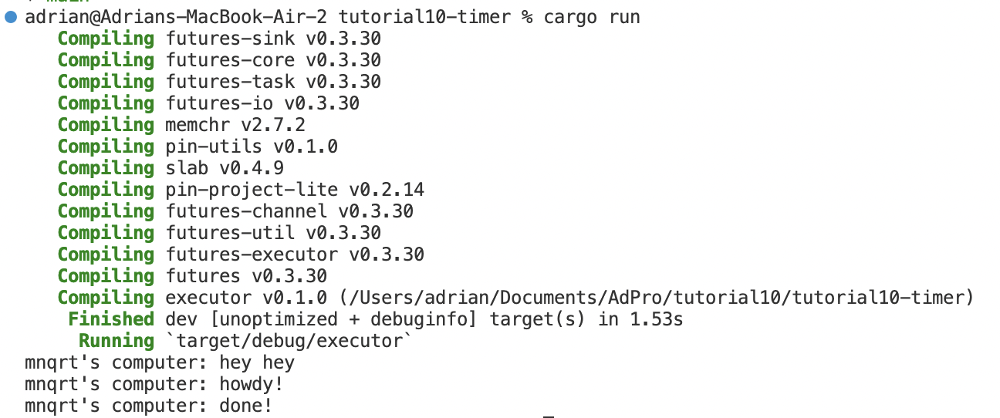
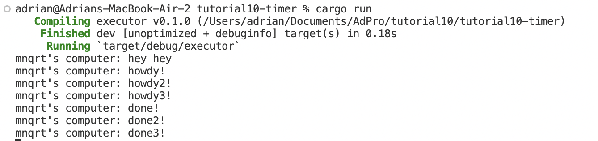

#### Nama : Adrian Aryaputra Hamzah
#### NPM : 2206811474
#### Kelas : ADPRO - B
#### ASDOS : GEN

# TUTORIAL - 10
## Refleksi

##### 1.2 Understanding how it works

Berdasarkan hasil output dari kode yang diberikan, dapat dipahami bahwa fungsi asynchronous (async) akan dieksekusi di luar aliran utama (main thread) yang memanggilnya. Akibatnya, kemungkinan output "... hey hey" akan muncul sebelum ".. howdy!" dan "... done!" karena kode "... hey hey" berada di luar fungsi asynchronous.
Hal ini terjadi karena program akan melanjutkan eksekusi dan mencetak "hey hey", sementara fungsi asynchronous masih menunggu hasil dari operasi asynchronous yang sedang dijalankan (dalam hal ini, future).

Hal ini terjadi sebab program akan tetap eksekusi dan print "hey hey" sedangkan fungsi async masih menunggu hasil dari future.

##### 1.3: Multiple Spawn and removing drop

Dari keluaran yang diberikan, dapat diamati bahwa keberadaan banyak spawner mengakibatkan peningkatan jumlah tugas yang dilakukan karena jumlah tugas yang dimasukkan ke dalam antrian tugas (task queue) bertambah. Tidak menghentikan spawner mengakibatkan program terus berjalan karena dianggap masih akan ada pengiriman data oleh spawner. Perintah drop(spawner) menandakan akhir dari interaksi dan spawner akan ditutup.

Ketika suatu spawner memanggil fungsi spawn, tercipta tugas baru yang dialirkan ke dalam antrian tugas. Executor akan mengambil satu tugas dari antrian tugas, menjalankannya, dan kemudian mengambil tugas berikutnya hingga selesai dan spawner dihentikan, menandakan selesainya interaksi.